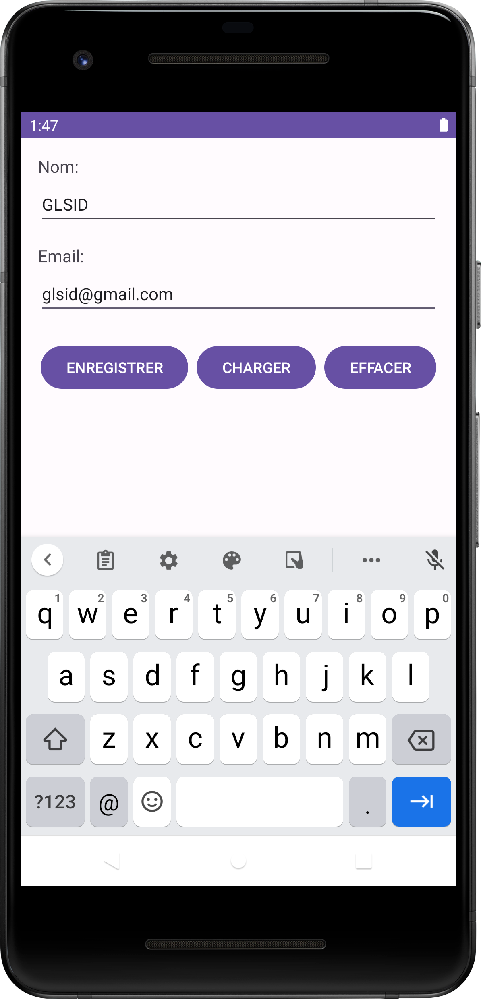
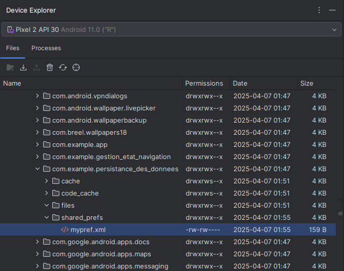
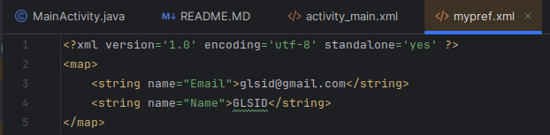

# Persistance des Données

Cette application Android permet de sauvegarder, charger et effacer des données utilisateur (nom et email) en utilisant les `SharedPreferences`.

## Fonctionnalités

- **Enregistrer** : Sauvegarde le nom et l'email dans les `SharedPreferences`.
- **Charger** : Charge les données sauvegardées (nom et email) depuis les `SharedPreferences`.
- **Effacer** : Efface les données sauvegardées (nom et email) des `SharedPreferences`.

## Structure du Projet

- `app/src/main/res/layout/activity_main.xml` : Fichier de layout XML définissant l'interface utilisateur.
- `app/src/main/java/com/example/persistance_des_donnees/MainActivity.java` : Activité principale contenant la logique pour sauvegarder, charger et effacer les données.

## Utilisation

1. **Enregistrer des données** :
    - Saisissez un nom et un email dans les champs correspondants.
    - Cliquez sur le bouton **ENREGISTRER** pour sauvegarder les données.

2. **Charger des données** :
    - Cliquez sur le bouton **CHARGER** pour charger les données sauvegardées dans les champs de texte.

3. **Effacer des données** :
    - Cliquez sur le bouton **EFFACER** pour effacer les données sauvegardées et vider les champs de texte.

